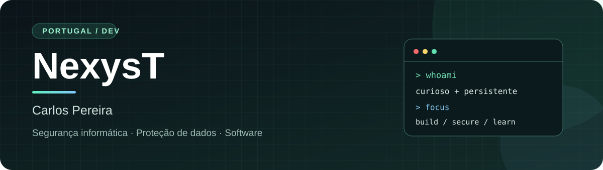
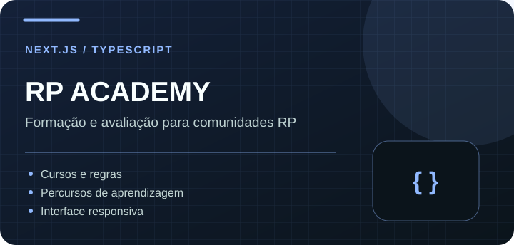
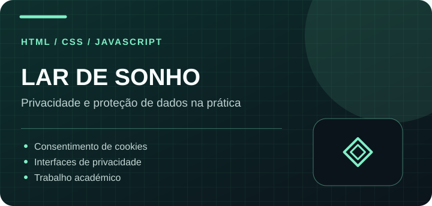
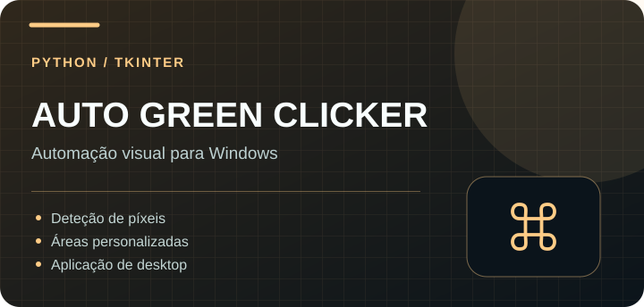
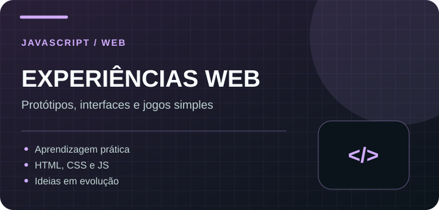

  

  
  

 

<h2 align="center">Olá, sou o Carlos.</h2>

  Gosto de transformar uma ideia num projeto que se consiga abrir, testar e compreender. 
  Concluí um CTeSP em <strong>Segurança e Proteção de Dados para Sistemas de Informação</strong>. 
  Aqui reúno projetos pessoais, trabalhos académicos e ferramentas que vou melhorando.

 

<h2>✦ Projetos em destaque</h2>

<table>
  <tr>
    <td width="50%" valign="top">
      
      <h3><a href="https://github.com/NexysT/RP-Academy">RP Academy ↗</a></h3>
      Plataforma de formação para comunidades de roleplay. Estou a trabalhar nas interfaces, nos conteúdos e nos percursos de aprendizagem.
        <code>Next.js</code> <code>React</code> <code>TypeScript</code>
    </td>
    <td width="50%" valign="top">
      
      <h3><a href="https://github.com/NexysT/larsonho">Lar de Sonho ↗</a></h3>
      Trabalho académico centrado na apresentação de informações de privacidade, escolhas de cookies e experiência do utilizador.
        <code>HTML</code> <code>CSS</code> <code>JavaScript</code>
    </td>
  </tr>
  <tr>
    <td width="50%" valign="top">
      
      <h3><a href="https://github.com/NexysT/twitchreward">Auto Green Clicker ↗</a></h3>
      Aplicação de desktop para experimentar deteção visual e automatização de ações com base nas cores de uma área do ecrã.
        <code>Python</code> <code>Tkinter</code>
    </td>
    <td width="50%" valign="top">
      
      <h3><a href="https://github.com/NexysT/IA">Experiências Web ↗</a></h3>
      Pequenos protótipos de interface e lógica em JavaScript. Algumas experiências estão funcionais; outras continuam em desenvolvimento.
        <code>JavaScript</code> <code>HTML</code> <code>CSS</code>
    </td>
  </tr>
</table>

 

<h2>✦ CasaFotos</h2>

Criei o <a href="https://github.com/NexysT/CasaFotos"><strong>CasaFotos</strong></a> para explorar uma biblioteca privada de fotografias com armazenamento num PC Windows e uma aplicação Android. É um protótipo pessoal com código e limitações documentadas.

<a href="https://github.com/NexysT/CasaFotos"><strong>Explorar o CasaFotos ↗</strong></a>

 

<h2>✦ No meu ambiente de trabalho</h2>

  

  
<strong>Áreas que estou a aprofundar</strong>

   
  Segurança de aplicações web, automatização, desenvolvimento full-stack e proteção de dados. Quero continuar a aprender com projetos que tenham uma utilização concreta, documentação clara e espaço para evoluir.

 

  <a href="https://github.com/NexysT?tab=repositories"><strong>Todos os projetos</strong></a>
  &nbsp;·&nbsp;
  <a href="https://github.com/NexysT/CasaFotos/issues"><strong>Falar sobre o CasaFotos</strong></a>

Carlos Pereira · Portugal · Português europeu

