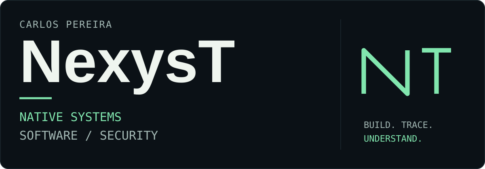
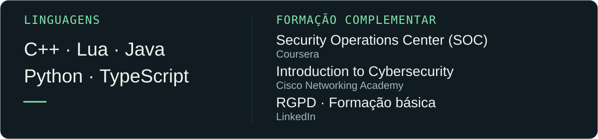
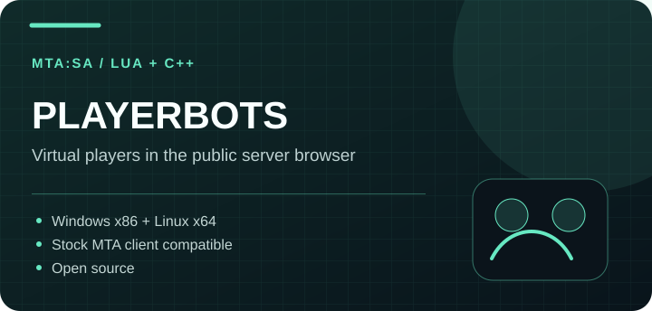
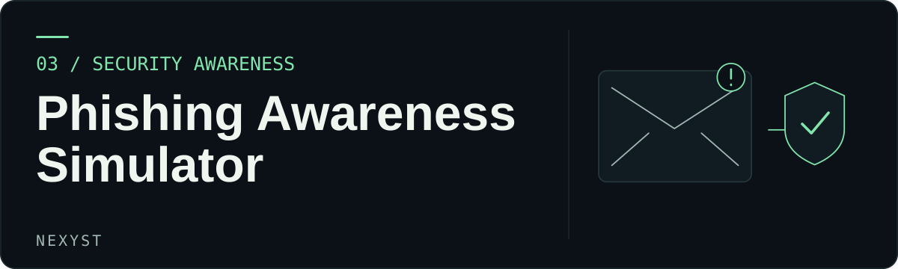

<picture>
  <source media="(max-width: 600px)" srcset="./assets/profile-banner-mobile.svg">
  
</picture>

 

### Olá, sou o Carlos.

Gosto de transformar ideias em projetos que se consigam abrir, testar e compreender. Quando algo me desperta a curiosidade, gosto de ir perceber o que está por trás.

Concluí um CTeSP em **Segurança e Proteção de Dados para Sistemas de Informação**.

<picture>
  <source media="(max-width: 600px)" srcset="./assets/profile-skills-mobile.svg">
  
</picture>

 

## Projetos em destaque

<a href="https://github.com/NexysT/MTA/tree/main/PlayerBots">
  <picture>
    <source media="(max-width: 600px)" srcset="./assets/projects/playerbots-mobile.svg">
    
  </picture>
</a>

Módulos **C++** integrados com **MTA:SA** para apresentar jogadores virtuais no browser de servidores. O trabalho cruza hooking, debugging do cliente e análise do protocolo ASE e de `PingStatus`, com implementações próprias para **Windows x86** e **Linux x64**.

**Demonstra:** integração nativa, análise de ABI e diagnóstico de comportamento a baixo nível. As builds compatíveis e o percurso de desenvolvimento estão documentados.

[Código e instalação ↗](https://github.com/NexysT/MTA/tree/main/PlayerBots) · [Arquitetura](https://github.com/NexysT/MTA/blob/main/PlayerBots/docs/ARCHITECTURE.md) · [Debugging e desenvolvimento](https://github.com/NexysT/MTA/blob/main/PlayerBots/docs/DEVELOPMENT-JOURNEY.md)

 

<a href="https://github.com/NexysT/CasaFotos">
  <picture>
    <source media="(max-width: 600px)" srcset="./assets/projects/casafotos-mobile.svg">
    
  </picture>
</a>

Uma biblioteca de fotografias que nasceu de um problema meu: guardar os originais no computador de casa e consultá-los no telemóvel. Liga uma **aplicação Android em Java**, um **backend HTTPS em Python**, um índice **SQLite** e **armazenamento local no Windows**.

**Demonstra:** construção de uma aplicação integrada, da interface ao servidor e aos ficheiros. É um protótipo pessoal com código, instalação e limites de validação documentados.

[Explorar a aplicação ↗](https://github.com/NexysT/CasaFotos) · [Estado da validação](https://github.com/NexysT/CasaFotos/blob/main/VALIDACAO.md) · [Segurança](https://github.com/NexysT/CasaFotos/blob/main/SECURITY.md)

 

<picture>
  <source media="(max-width: 600px)" srcset="./assets/projects/phishing-awareness-mobile.svg">
  
</picture>

Projeto de **cybersecurity e awareness** orientado à identificação de sinais de phishing e engenharia social. Usa o conceito de simulação controlada para formação e demonstração de risco.

**Demonstra:** ligação entre risco técnico, comportamento humano e comunicação de segurança. **Projeto privado** — apresentado aqui pelo seu objetivo educativo.

## Outros projetos

- **[RP Academy](https://github.com/NexysT/RP-Academy)** — formação para roleplay, quizzes e progresso local · Next.js / React / TypeScript.
- **[Auto Green Clicker](https://github.com/NexysT/twitchreward)** — automação visual e deteção de cor no Windows · Python / Tkinter.
- **[Lar de Sonho](https://github.com/NexysT/larsonho)** — projeto académico sobre privacidade e preferências de cookies · HTML / CSS / JavaScript.

## Áreas técnicas

**Sistemas nativos** · C++, Lua, hooking, debugging e análise de ABI em Windows / Linux.  
**Aplicações** · Java / Android, Python, SQLite, TypeScript, React e Next.js.  
**Segurança** · awareness, segurança de aplicações e proteção de dados.

[LinkedIn](https://www.linkedin.com/in/carlosdpereira/) · [Todos os repositórios](https://github.com/NexysT?tab=repositories) · [Demonstração RP Academy](https://rp-academy.vercel.app/) · [Demonstração Lar de Sonho](https://nexyst.github.io/larsonho/)
